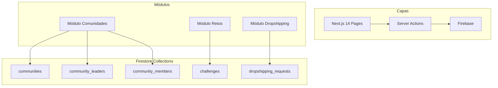

# FEATURE-comunidades — Módulos Comunidades, Retos y Dropshipping

> **Versión:** 1.0  
> **Fecha:** 2026-02-23  
> **Proyecto:** ADMA Inventario

---

## 1. Resumen Ejecutivo

Se implementan 3 nuevos módulos para expandir el ecosistema ADMA:

1. **MÓDULO COMUNIDADES**: Líderes de comunidad pueden registrarse, gestionar sus comunidades y monitorear comisiones/ranking
2. **MÓDULO RETOS**: Sistema de retos para usuarios (individuales o por comunidad)
3. **MÓDULO DROPSHIPPING**: Formulario de sugerencias de productos con proceso de aprobación

---

## 2. Diagrama de Arquitectura



---

## 3. Autenticación y Autorización

### 3.1 Mecanismos de Auth

| Actor | Mecanismo | Notas |
|-------|-----------|-------|
| Admin ADMA | Firebase Auth (email/password) | Rol existente `admin` |
| Líder de Comunidad | Firebase Auth (email/password) | Nuevo rol `community_leader` |
| Usuario Miembro | Firebase Auth + invite link | Nuevo rol `member` |
| Usuario Regular | Firebase Auth (email/password) | Roles existentes: `logistics`, `commercial` |

### 3.2 Flujo de Registro

```
┌─────────────────────────────────────────────────────────────┐
│ LÍDER DE COMUNIDAD                                          │
├─────────────────────────────────────────────────────────────┤
│ 1. Se registra en /login → /register-community-leader      │
│ 2. Firebase Auth: crea cuenta email/password                │
│ 3. Firestore: crea documento en `community_leaders`        │
│ 4. Campo `verified: false` → espera aprobación admin      │
│ 5. Admin aprueba → `verified: true`                        │
└─────────────────────────────────────────────────────────────┘

┌─────────────────────────────────────────────────────────────┐
│ USUARIO MIEMBRO                                             │
├─────────────────────────────────────────────────────────────┤
│ Opción A: Registro directo (Firebase Auth)                 │
│ Opción B: Registro por invite del líder                     │
│   - Líder genera código único: /register?code=XXXXXXXX         │
│   - Código se valida en server (no confiar en URL)            │
│   - Usuario se registra → automáticamente asignado          │
│   - Campo `referredBy: LEADER_ID` en Firestore              │
└─────────────────────────────────────────────────────────────┘
```

### 3.3 Permisos (Firestore Rules)

```javascript
// community_leaders
allow read: if request.auth != null;
allow write: if request.auth.uid == resource.data.uid || request.auth.token.role == 'admin';

// communities
allow read: if request.auth != null;
allow write: if request.auth.token.role == 'admin' || 
             exists(/databases/$(database)/documents/community_leaders/$(request.auth.uid));

// community_members
// CRITICAL: No permitir create público - solo via Server Action con validación
allow read: if request.auth != null && 
            (request.auth.uid == resource.data.uid ||
             request.auth.token.role == 'admin' ||
             exists(/databases/$(database)/documents/community_leaders/$(request.auth.uid)));
// create solo via Server Action que valida inviteCode
allow create: if request.auth != null;  // La validación real está en la Server Action
allow update: if request.auth.uid == resource.data.uid || request.auth.token.role == 'admin';

// challenges
allow read: if request.auth != null;
allow create, update, delete: if request.auth.token.role == 'admin' ||
                               exists(/databases/$(database)/documents/community_leaders/$(request.auth.uid));

// dropshipping_requests
allow read: if request.auth.token.role in ['admin', 'commercial'];
allow create: if request.auth != null;
allow update: if request.auth.token.role in ['admin', 'commercial'];
```

---

## 4. Modelo de Datos

### 4.1 Colecciones Firestore

```typescript
// communities
interface Community {
  id: string;
  name: string;
  leaderId: string;           // ref: community_leaders
  description?: string;
  inviteCode: string;         // código único para referidos
  memberCount: number;        // denormalized
  totalSales: number;         // para ranking
  totalCommission: number;    // para ranking
  createdAt: Timestamp;
  updatedAt: Timestamp;
}

// community_leaders
interface CommunityLeader {
  id: string;                 // uid de Firebase Auth
  email: string;
  displayName: string;
  phone?: string;
  communityId?: string;       // ref: communities
  verified: boolean;           // requiere aprobación admin
  commissionRate: number;     // % de comisión (default: 10%)
  totalCommission: number;    // acumulado
  rank: number;               // posición en ranking
  createdAt: Timestamp;
}

// community_members
interface CommunityMember {
  id: string;                 // uid de Firebase Auth
  email: string;
  displayName: string;
  leaderId: string;           // ref: community_leaders
  communityId: string;       // ref: communities
  referredBy?: string;       // uid del líder que invitó
  joinedAt: Timestamp;
}

// challenges
interface Challenge {
  id: string;
  title: string;
  description: string;
  type: 'individual' | 'community';
  communityId?: string;       // si es type: 'community'
  targetMetric: string;       // 'sales', 'members', etc.
  targetValue: number;
  prize: string;
  startDate: Timestamp;
  endDate: Timestamp;
  status: 'active' | 'completed' | 'cancelled';
  createdBy: string;
  createdAt: Timestamp;
}

// dropshipping_requests
interface DropshippingRequest {
  id: string;
  userId: string;             // quien solicita
  imageUrl: string;           // Firebase Storage
  productLink: string;
  quantity: number;
  country: string;
  observations: string;
  modality: 'dropshipping' | 'bulk' | 'both';
  status: 'pending' | 'approved' | 'rejected';
  adminResponse?: string;
  approvedQuantity?: number;
  approvedModality?: string;
  reviewedBy?: string;
  createdAt: Timestamp;
  updatedAt: Timestamp;
}
```

### 4.2 Notas de Seguridad

- **Imágenes de dropshipping**: Firebase Storage con lifecycle de 30 días
- **Códigos de invite**: Generados con `nanoid(8)` para evitar guessable URLs
- **Validación de imágenes**: Se valida tipo MIME y tamaño (max 5MB) antes de subir a Storage
- **Comisiones**: Solo admins pueden modificar `totalCommission`
- **Validación de invite**: Siempre del lado del servidor, nunca confiar en params de URL
- **Validación de invite**: Siempre del lado del servidor, nunca confiar en params de URL

---

## 5. Índices de Firestore Requeridos

Las siguientes queries requieren índices compuestos en Firestore:

```json
// firestore.indexes.json - agregar estas entradas
{
  "indexes": [
    {
      "collectionGroup": "community_leaders",
      "queryScope": "COLLECTION",
      "fields": [
        { "fieldPath": "verified", "order": "ASC" },
        { "fieldPath": "rank", "order": "ASC" }
      ]
    },
    {
      "collectionGroup": "challenges",
      "queryScope": "COLLECTION",
      "fields": [
        { "fieldPath": "status", "order": "ASC" },
        { "fieldPath": "endDate", "order": "ASC" }
      ]
    },
    {
      "collectionGroup": "dropshipping_requests",
      "queryScope": "COLLECTION",
      "fields": [
        { "fieldPath": "status", "order": "ASC" },
        { "fieldPath": "createdAt", "order": "DESC" }
      ]
    },
    {
      "collectionGroup": "communities",
      "queryScope": "COLLECTION",
      "fields": [
        { "fieldPath": "inviteCode", "order": "ASC" }
      ]
    }
  ]
}
```

---

## 6. Esquema de Testing

| Nivel | Herramienta | Cobertura | Casos E2E Críticos |
|-------|-------------|-----------|-------------------|
| Unit | Vitest | 70%+ | Funciones de cálculo de comisión, generación de códigos |
| Integration | Vitest + Firebase Emulator | N/A | Escritura/lectura de colecciones |
| E2E | Playwright | Críticos | Registro líder, invite usuario, envío solicitud dropshipping |

### 5.1 Casos de Prueba

```typescript
// Unit tests
describe('commission', () => {
  it('calculates 10% commission correctly');
  it('applies custom rate for verified leaders');
});

describe('inviteCode', () => {
  it('generates unique 8-char code');
  it('validates existing code');
});

// E2E tests
describe('Community Registration Flow', () => {
  it('leader can register and wait for verification');
  it('admin can verify a leader');
  it('user can join via invite link');
});

describe('Dropshipping Flow', () => {
  it('user can submit product request with image');
  it('admin can approve/reject request');
});
```

---

## 7. CI/CD Pipeline

```yaml
# .github/workflows/communities.yml
name: Communities Module

on:
  pull_request:
    branches: [main]
    paths:
      - 'src/app/communities/**'
      - 'src/app/challenges/**'
      - 'src/app/dropshipping/**'

jobs:
  test:
    runs-on: ubuntu-latest
    steps:
      - uses: actions/checkout@v4
      - run: npm ci
      - run: npm run lint
      - run: npm run typecheck
      - run: npm run test -- --coverage

  build:
    needs: test
    runs-on: ubuntu-latest
    steps:
      - run: npm run build

deploy:
  needs: build
  if: github.ref == 'refs/heads/main'
  runs-on: ubuntu-latest
  steps:
    - run: firebase deploy --only hosting
```

---

## 8. Observabilidad

### 7.1 Errores y Tracking

| Recurso | Herramienta | Config |
|---------|-------------|--------|
| Error tracking | Firebase Crashlytics | Grupos: auth, firestore, storage |
| Logs | Firebase Functions Logging | N/A (Firebase App Hosting) |
| Health check | Firebase Hosting | `/api/health` |

### 7.2 Métricas de Negocio

| Métrica | Collection | Query |
|---------|-----------|-------|
| Líderes registrados | community_leaders | `where('verified', '==', true)` |
| Miembros por comunidad | community_members | `where('leaderId', '==', uid)` |
| Retos activos | challenges | `where('status', '==', 'active')` |
| Solicitudes dropshipping | dropshipping_requests | `where('status', '==', 'pending')` |

### 7.3 Health Check

```typescript
// src/app/api/health/route.ts
import { NextResponse } from 'next/server';

export async function GET() {
  return NextResponse.json({
    status: 'ok',
    timestamp: new Date().toISOString(),
    modules: {
      communities: 'ok',
      challenges: 'ok',
      dropshipping: 'ok'
    }
  });
}
```

---

## 9. Rutas de Página

| Ruta | Descripción | Auth |
|------|-------------|------|
| `/communities` | Dashboard de comunidad (líder) | `community_leader` |
| `/communities/ranking` | Ranking de comunidades | `community_leader` |
| `/challenges` | Lista de retos activos | autenticado |
| `/challenges/[id]` | Detalle de reto | autenticado |
| `/dropshipping` | Formulario de solicitud | autenticado |
| `/dropshipping/admin` | Panel de aprobación (admin) | `admin` + verificación en layout |

**Nota:** Todas las rutas sensibles (/admin, /communities) deben verificar el rol del usuario en el layout o middleware, NO solo ocultar botones en UI.

---

## 10. Server Actions

```typescript
// src/app/actions/communities.ts
registerCommunityLeader(data: RegisterLeaderDTO): Promise<CommunityLeader>
verifyCommunityLeader(leaderId: string): Promise<void>

// Invite code - genera y valida código único (no UID)
generateInviteCode(leaderId: string): Promise<string>
validateInviteCode(code: string): Promise<{leaderId: string, communityId: string} | null>

assignMemberToCommunity(memberId: string, inviteCode: string): Promise<void>
getCommunityRanking(): Promise<CommunityRanking[]>

// src/app/actions/challenges.ts
createChallenge(data: CreateChallengeDTO): Promise<Challenge>
getActiveChallenges(): Promise<Challenge[]>
joinChallenge(challengeId: string, userId: string): Promise<void>

// src/app/actions/dropshipping.ts
const MAX_IMAGE_SIZE = 5 * 1024 * 1024; // 5MB
const ALLOWED_IMAGE_TYPES = ['image/jpeg', 'image/png', 'image/webp'];

submitProductRequest(data: FormData): Promise<DropshippingRequest> {
  // Validar tipo y tamaño de imagen antes de subir
  const image = data.get('image');
  if (!ALLOWED_IMAGE_TYPES.includes(image.type)) {
    throw new Error('Tipo de imagen no permitido');
  }
  if (image.size > MAX_IMAGE_SIZE) {
    throw new Error('Imagen muy grande (max 5MB)');
  }
  // Subir a Firebase Storage...
}

approveDropshippingRequest(requestId: string, response: ApprovalResponse): Promise<void>
rejectDropshippingRequest(requestId: string, reason: string): Promise<void>
```

---

## 11. Stack Recomendado

Se mantiene el stack existente del proyecto:

| Capa | Tecnología | Notas |
|------|------------|-------|
| Frontend | Next.js 14 | App Router |
| UI | Shadcn/UI + Tailwind | Componentes existentes |
| Backend | Firebase Firestore | Colecciones nuevas |
| Storage | Firebase Storage | Imágenes dropshipping |
| Auth | Firebase Auth | Mismo sistema |

---

## 12. Timeline Estimado

| Fase | Descripción | Estimación |
|------|-------------|------------|
| 1 | Schema Firestore + Auth | 2 días |
| 2 | Registro líder + verificación admin | 3 días |
| 3 | Sistema de referidos + invite links | 2 días |
| 4 | Dashboard comunidades + ranking | 2 días |
| 5 | Módulo retos | 2 días |
| 6 | Módulo dropshipping | 2 días |
| 7 | Testing + Bug fixes | 2 días |
| **Total** | | **15 días** |

---

*Documento generado por el System Architect*
