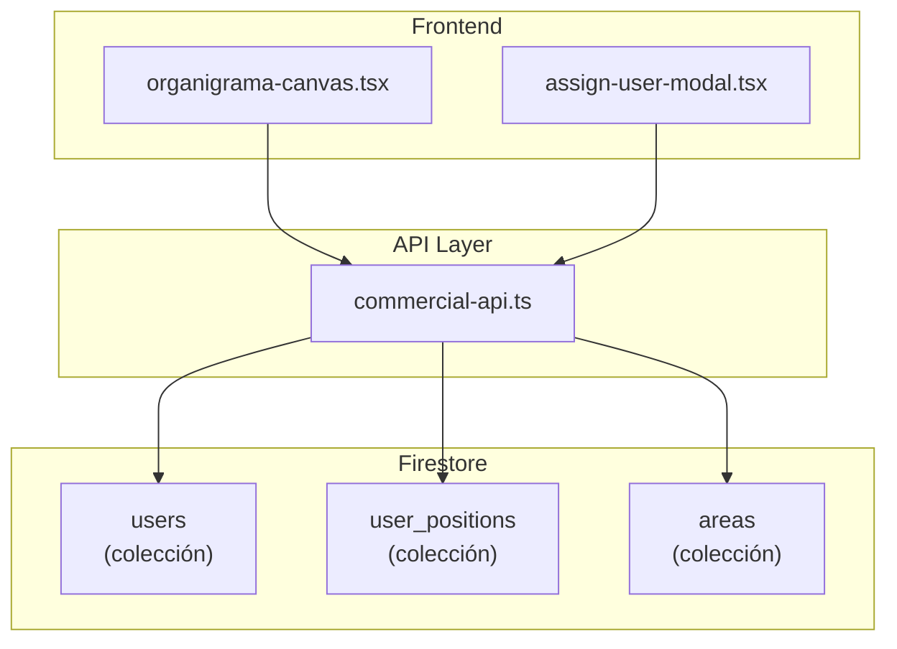

# PLAN — FEATURE-organigrama-fix

> Análisis del sistema de organigrama y corrección del bug de usuario eliminado

---

## 1. Resumen Ejecutivo

**Problema reportado:** Al eliminar un usuario, este sigue apareciendo en el organigrama.

**Causa raíz identificada:** 
- El organigrama obtiene posiciones de la colección `user_positions` 
- NO valida si el usuario existe en la colección `users`
- Cuando se elimina un usuario de `users`, la posición en `user_positions` queda huérfana

**Solución:** Implementar validación en el organigrama + crear función de limpieza

---

## 2. Análisis del Sistema

### 2.1 Arquitectura del Organigrama



### 2.2 Colecciones Firestore

| Colección | Propósito | Clave |
|-----------|-----------|-------|
| `users` | Perfiles de usuarios | `id` = UID Firebase |
| `user_positions` | Posiciones en organigrama | `id` = userId |
| `areas` | Áreas de trabajo | `id` = auto-generado |

### 2.3 Flujo Actual

```
1. assignUserToAreaAction() → setUserPosition()
2. setUserPosition() → setDoc(doc(db, 'user_positions', userId), data)
3. getAllUserPositions() → getDocs(collection(db, 'user_positions'))
4. organigrama-canvas.tsx muestra usuarios sin validar existencia
```

---

## 3. Análisis del Bug

### 3.1 Causa Raíz

El componente [`organigrama-canvas.tsx`](src/app/commercial/tareas/components/organigrama/organigrama-canvas.tsx:50) filtra usuarios así:

```typescript
const usersByArea = areas.map(area => ({
  area,
  users: userPositions.filter(up => up.areaId === area.id)
}));
```

**Problema:** No valida si `userId` existe en la colección `users`.

### 3.2 Flujo del Bug

```
1. Admin elimina usuario en Settings
2. Usuario se elimina de colección 'users' ✓
3. Posición en 'user_positions' NO se elimina ✗
4. Organigrama carga posiciones huérfanas
5. Usuario "fantasma" aparece en organigrama
```

---

## 4. Solución Propuesta

### 4.1 Opción A: Validación en Frontend (Inmediata)

Modificar [`organigrama-canvas.tsx`](src/app/commercial/tareas/components/organigrama/organigrama-canvas.tsx:1) para filtrar usuarios que no existen.

**Ventajas:** 
- Solución rápida
- No requiere cambios en backend
- Funciona con datos existentes

**Desventajas:**
- Carga adicional de red
- No limpia datos huérfanos

### 4.2 Opción B: Función de Eliminación (Completa)

Crear función [`deleteUserPosition(userId)`](src/lib/commercial-api.ts:1134) en `commercial-api.ts` y llamarla al eliminar usuario.

**Ventajas:**
- Limpia datos huérfanos
- Mejor integridad de datos

**Desventajas:**
- Requiere implementación de eliminación de usuarios

### 4.3 Recomendación: Opción A + B Combinadas

1. **Inmediato:** Implementar validación en frontend (Opción A)
2. **Post:** Crear función de limpieza (Opción B)

---

## 5. Implementación

### 5.1 Cambios en [`organigrama-canvas.tsx`](src/app/commercial/tareas/components/organigrama/organigrama-canvas.tsx:1)

```typescript
// Agregar validación de existencia de usuario
const validUserIds = new Set(users.map(u => u.id));
const usersByArea = areas.map(area => ({
  area,
  users: userPositions
    .filter(up => up.areaId === area.id)
    .filter(up => validUserIds.has(up.userId)) // ← NUEVO: filtrar usuarios válidos
}));
```

### 5.2 Nueva función en [`commercial-api.ts`](src/lib/commercial-api.ts:1134)

```typescript
export const deleteUserPosition = async (userId: string): Promise<void> => {
  try {
    await deleteDoc(doc(db, USER_POSITIONS_COLLECTION, userId));
  } catch (error) {
    console.error("Error deleting user position:", error);
    throw error;
  }
};
```

---

## 6. Testing

| Nivel | Herramienta | Cobertura |
|-------|-------------|------------|
| Unit | Vitest | Funciones de API |
| Component | React Testing Library | OrganigramaCanvas |
| E2E | - | - |

### Casos Críticos

1. ✅ Organigrama no muestra usuarios eliminados
2. ✅ Organigrama muestra usuarios válidos
3. ✅ Modal de asignación solo muestra usuarios sin área

---

## 7. CI/CD

- **PR:** Lint + TypeScript + Tests
- **Deploy:** Solo si tests pasan

---

## 8. Observabilidad

- Console logs en funciones de API
- Error boundary en componentes React
- Health check via Firebase

---

## 9. Notas Adicionales

### Sobre "SOAP"
No se encontró referencia a SOAP en el código actual. Si te refieres a un servicio externo, por favor proporciona más contexto.

### Sobre la Página Commercial
La página `/commercial/tareas` integra:
- KanbanBoard (gestión de tareas)
- OrganigramaCanvas (estructura organizacional)
- CreateTaskModal / ViewTaskModal
- NotificationPanel
- AreaManagement (solo admin)

---

## 10. Acción Requerida

**Para proceder con la implementación, necesito confirmación de:**

1. ¿Prefieres la solución inmediata (validación frontend) o la completa (función de eliminación)?
2. ¿Tienes un ticket/requirement ID en ACP para reportar el progreso?

