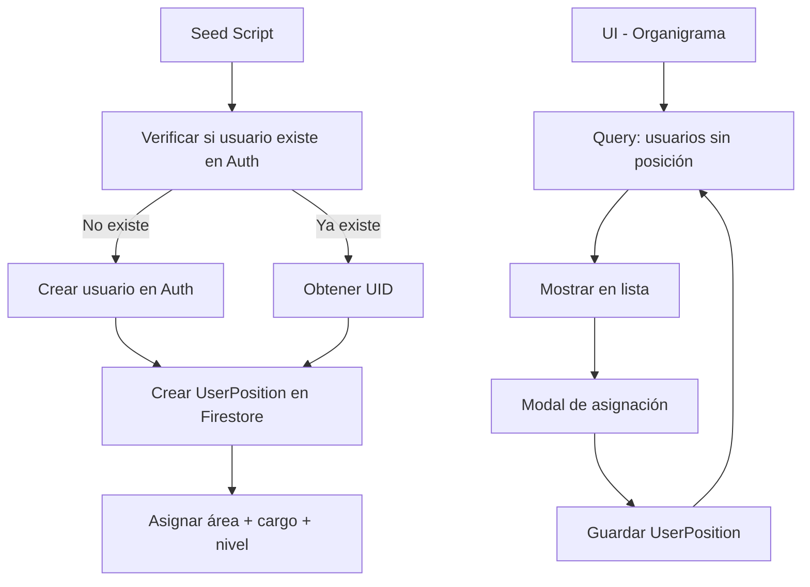

# PLAN — FEATURE: Seed de Usuarios + Asignación de Área en Organigrama

> **Architect:** Jarvin  
> **Fecha:** 2026-02-23  
> **Proyecto:** ADMA Inventario

---

## 1. Resumen Ejecutivo

Este feature tiene dos objetivos:

1. **Seed de usuarios:** Crear usuarios en Firebase Auth y asignar sus posiciones en el organigrama (área + cargo + nivel) a partir de una lista predefinida de 17 usuarios.
2. **Nueva funcionalidad UI:** Agregar la capacidad de listar usuarios sin área asignada y asignarles área + nivel desde un modal en el organigrama.

---

## 2. Lista de Usuarios a Seedear

| # | Nombre | Correo | Área | Cargo | Notas |
|---|--------|--------|------|-------|-------|
| 1 | Josue Soto Bolivar | marketingadmacompany@gmail.com | AUDIOVISUALES | Diseñador Audiovisual | Crear en Auth |
| 2 | Ana Maria Bedoya | ana.bedoya@adma.com.co | AUDIOVISUALES | Community Manager | Crear en Auth |
| 3 | Maryori Victoria | directoracomercialadma@gmail.com | COMERCIAL | Comerciante | Verificar si existe |
| 4 | Jhoan Motta | jhoanamotta@adma.com.co | COMERCIAL | Comerciante | Verificar si existe |
| 5 | Jose Manuel Suarez | josemsuarez@adma.com.co | COMERCIAL | Comerciante | Verificar si existe |
| 6 | Juan Jose Bedoya | gerente.comercial@admalab.com.co | COMERCIAL | Comerciante | Verificar si existe |
| 7 | Andres Camilo Buchelly | andrescbuchelly@adma.com.co | COMERCIAL | Comerciante | Verificar si existe |
| 8 | Jose David Aguirre | josedaguirre@adma.com.co | COMERCIAL | Comerciante | Verificar si existe |
| 9 | Oscar Gomez | asesorgrow344@gmail.com | COMERCIAL | Comerciante | Pendiente - Usuario Dropi |
| 10 | Maria del Mar Garay | mariagaray_15@hotmail.com | ADMINISTRATIVO | Gerente Administrativo | Crear en Auth |
| 11 | Camilo Useche | comercial1@gmail.com | ADMINISTRATIVO | TI | Crear en Auth |
| 12 | Xiomara Reyna | cordinador.operaciones@adma.com.co | ADMINISTRATIVO | Coordinador Operativo | Verificar si existe |
| 13 | Yurany Cuellar | admacontabilidad1@gmail.com | ADMINISTRATIVO | Contabilidad | Pendiente |
| 14 | Viviana Aguirre | recursoshumanosadma@gmail.com | ADMINISTRATIVO | Recursos Humanos | Pendiente |
| 15 | Martha Useche | admapedidos@gmail.com | ADMINISTRATIVO | Pedidos | Pendiente |
| 16 | Carlos Andres Gonzales | bodega.adma0@gmail.com | BODEGA | Auxiliar de bodega | Pendiente |
| 17 | Jairo Morales | admabodega@gmail.com | BODEGA | Auxiliar de bodega | Pendiente |

**Total:** 17 usuarios

**Eliminar:** info.kovia@gmail.com (usuario de prueba)

---

## 3. Arquitectura

### Stack
- **Frontend:** Next.js 14 + React + Shadcn/UI
- **Backend:** Firebase (Firestore + Auth) + Server Actions
- **Auth:** Firebase Auth (crear usuarios)
- **DB:** Firestore (colección `user_positions`)

### Flujo de Datos



---

## 4. Schema de Datos

### Firestore: `areas`
```typescript
interface Area {
  id: string;
  name: string;        // "COMERCIAL", "ADMINISTRATIVO", "AUDIOVISUALES", "BODEGA"
  color: string;       // Hex color
  description?: string;
  createdAt: Timestamp;
  updatedAt: Timestamp;
}
```

### Firestore: `user_positions`
```typescript
interface UserPosition {
  id: string;          // = userId
  userId: string;      // UID de Firebase Auth
  areaId: string;      // Referencia a área
  cargo: string;       // "Comerciante", "Coordinador", etc.
  nivel: number;       // 1-3 (jerarquía visual)
  posicionX: number;   // 0-100 (opcional, para canvas)
  posicionY: number;   // 0-100 (opcional, para canvas)
  updatedAt: Timestamp;
}
```

### Áreas a crear (si no existen)
| name | color | description |
|------|-------|-------------|
| COMERCIAL | #3B82F6 | Área comercial y ventas |
| ADMINISTRATIVO | #10B981 | Área administrativa y financiera |
| AUDIOVISUALES | #F59E0B | Área de marketing y contenido |
| BODEGA | #EF4444 | Área de bodega y logística |

---

## 5. Componentes a Implementar

### 5.1 Seed Script (`scripts/seed-usuarios-organigrama.ts`)

```typescript
interface UsuarioSeed {
  nombre: string;
  email: string;
  area: 'COMERCIAL' | 'ADMINISTRATIVO' | 'AUDIOVISUALES' | 'BODEGA';
  cargo: string;
  nivel: number; // 1: gerente/coordinador, 2: comercial, 3: auxiliar
}

interface SeedResult {
  email: string;
  uid: string;
  password: string;  // Solo para usuarios creados
  status: 'created' | 'exists' | 'error';
  error?: string;
}

// Pasos:
// 1. Verificar/crear áreas en Firestore
// 2. Por cada usuario:
//    a. Verificar si existe en Firebase Auth por email
//    b. Si no existe → crear con password temporal + guardar en resultado
//    c. Obtener UID
//    d. Crear documento en user_positions
// 3. Retornar array de SeedResult con credenciales
// 4. Guardar reporte en `scripts/output/credenciales-{fecha}.json`
```

**Reporte de credenciales:**
El script generará un archivo `scripts/output/credenciales-{YYYY-MM-DD}.json` con:
```json
[
  {
    "email": "usuario@adma.com.co",
    "uid": "abc123...",
    "password": "ADMA2026!x8k2m9p1",
    "status": "created"
  }
]
```

**Entregable:** David recibirá este archivo JSON con la lista de credenciales de los usuarios nuevos creados.

### 5.2 Server Actions (`src/app/actions/organigrama.ts`)

| Función | Descripción |
|---------|-------------|
| `getUnassignedUsers()` | Lista usuarios de Auth sin posición en organigrama |
| `assignUserToArea(userId, areaId, cargo, nivel)` | Asigna área y nivel a un usuario |
| `updateUserPosition(userId, data)` | Actualiza posición de usuario |

### 5.3 Componente UI (`src/app/commercial/tareas/components/organigrama/`)

| Componente | Descripción |
|------------|-------------|
| `UnassignedUsersList.tsx` | Lista de usuarios sin área (nueva sección) |
| `AssignUserModal.tsx` | Modal para asignar área + nivel |
| Actualizar `organigrama-canvas.tsx` | Integrar nueva funcionalidad |

---

## 6. Autenticación y Seguridad

### Auth
- **Firebase Admin SDK** para crear usuarios en Auth
- Password temporal: `ADMA2026!{primeraLetraNombre}` (ej: `ADMA2026!J`)

### Reglas Firestore
```firestore
// user_positions - solo admin puede escribir
match /user_positions/{userId} {
  allow read: if request.auth != null;
  allow write: if request.auth.token.admin == true;
}
```

---

## 7. Testing

| Nivel | Herramienta | Cobertura | Casos Críticos |
|-------|-------------|-----------|----------------|
| Unit | Vitest | Funciones utilitarias | Validación de emails, parsing de usuarios |
| Integration | Firebase Emulator | Seed script | Crear usuario, verificar posición |
| E2E | Playwright | Flujo UI | Asignar área desde modal |

### Casos E2E Críticos
1. ✅ Seed completa sin errores
2. ✅ Usuario existente no se duplica
3. ✅ Asignar área desde modal actualiza organigrama
4. ✅ Usuario sin área aparece en lista de no asignados

---

## 8. CI/CD Pipeline

```yaml
# PR: lint + typecheck + tests
pr-checks:
  - npm run lint
  - npm run typecheck
  - npm run test

# Deploy: Solo si tests pasan
deploy:
  - npm run test
  - firebase deploy --only hosting
```

---

## 9. Observabilidad

| Tipo | Herramienta | Qué registrar |
|------|-------------|---------------|
| Logs | Firebase Functions | Errores en seed script |
| Error Tracking | Sentry (configurar) | Errores en asignación |
| Health Check | Endpoint `/api/health` | Verificar conexión Firestore |

---

## 10. Pendientes / Decisiones

- [ ] **Decisión:** Password temporal o email de verificación → **Password temporal** + email reset
- [ ] **Decisión:** ¿Niveles por defecto? → **Nivel 2** (comerciante/auxiliar) para todos, ajustar manualmente después

---

## 11. Effort Estimado

| Tarea | Effort |
|-------|--------|
| Seed script | 2h |
| Server Actions | 1h |
| UI - Lista sin asignar | 2h |
| UI - Modal asignación | 2h |
| Testing | 2h |
| **Total** | **~9h** |
